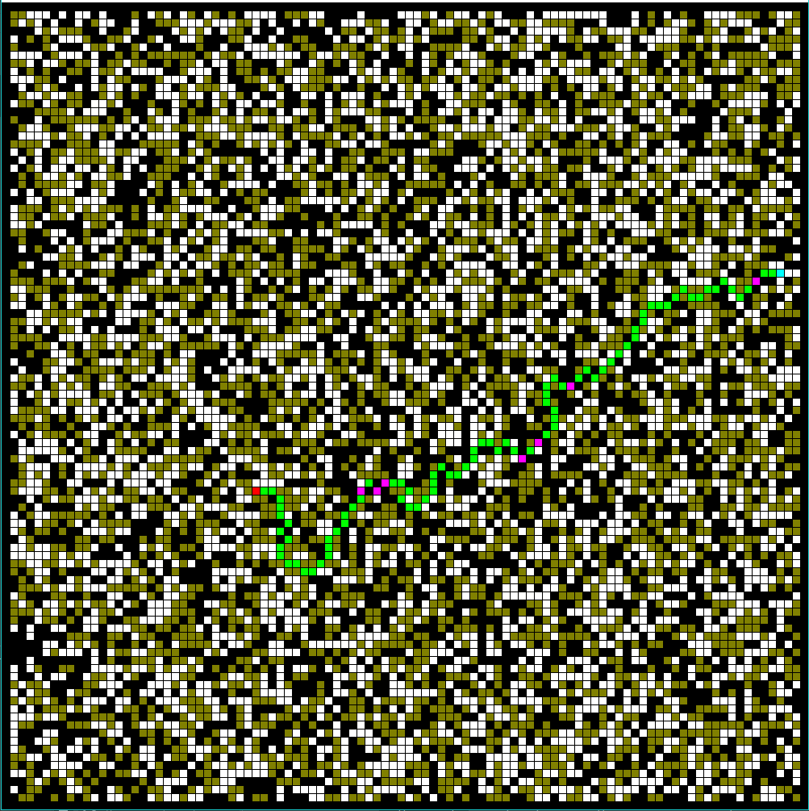

# A-Star-QT

A simple visualizer for A* Pathfinding Algorithm written on C++ using QT Framework.

Here's the example of it's output:

**Legend**
* White cell - free space
* Black cell - wall
* Yellow cell - sand(also free space, but more hard to pass)
* Green cell - path
* Pink cell - path through sand
